### <code>harshvangar2702-debug@github ~ $ ./contributions.sh</code>

  

### <code>harshvangar2702-debug@github ~ $ whoami</code>

<table>
  <tr>
    <td valign="top">
      
    </td>
    <td valign="top">
      
    </td>
  </tr>
</table>

 

### <code>harshvangar2702-debug@github ~ $ ./links.sh</code>

<strong>Full-Stack Developer • UI/UX Designer • Python & React Specialist</strong>

<em>Building User-Centric Web Experiences | Jalna, Maharashtra, India</em>

  
  &nbsp;
  
  &nbsp;
  

 

---

*Automated daily with GitHub Actions • Powered by Python & Animated SVGs*

